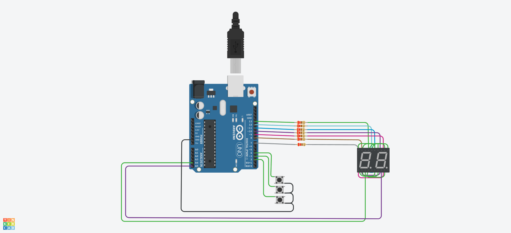

# Ejemplo Documentación 

## Integrantes 
- Santiago Oliveira

## Descripción
Suma,resta y reinicia un contador, el cual se mostrará en dos displays de 7 segmentos 

# Funcones principales
~~~ C (lenguaje en el que esta escrito)
/*
sumar()
Delay de 3 milisegundos
Suma en uno al contador
retorno: void
*/
void sumar(){
  delay(300);
  cont++;
  Serial.println(cont);
}

/*
restar()
Delay de 3 milisegundos
Resta en uno al contador
retorno: void
*/
void restar(){
  delay(300);
  cont--;
}

/*
reiniciar()
Delay de 3 milisegundos
Establece el valor del contador en cero.
retorno: void
*/
void reiniciar(){
  delay(300);
  cont = 0;
}

/*
obteterDecena(int cont)
param: int cont
Calcula la decena de un numero y la retorna
retorno: int
*/
int obtenerDecena(int cont){
  	decena = (cont / 10) % 10;
    return decena;
  }

/*
obtenerUnidad(int cont)
param: int cont
Calcula la unidad de un numero y la retorna
retorno: int
*/
int obtenerUnidad(int cont){
  unidad = cont % 10;
  return unidad;
}

/*
esPrimo(int numero)
param: int numero
Analiza el numero pasado por parametro y retorna un booleano en caso 
de que sea o no un numero primo matemático
retorno: boolean
*/
bool esPrimo(int numero) {
    if (numero <= 1) {
        return false;
    }
    if (numero <= 3) {
        return true;
    }
    if (numero % 2 == 0 || numero % 3 == 0) {
        return false;
    }
    for (int i = 5; i * i <= numero; i += 6) {
        if (numero % i == 0 || numero % (i + 2) == 0) {
            return false;
        }
    }
    return true;
}
~~~

## :robot: Link al proyecto
- [proyecto](https://www.tinkercad.com/things/6v8RVjOtjC2-spd-parte-1-oliveira-santiago/editel?sharecode=ReVZ-UB_nqPKDA4PzynATapUCj0WT5fvEQYPF618nRI)

